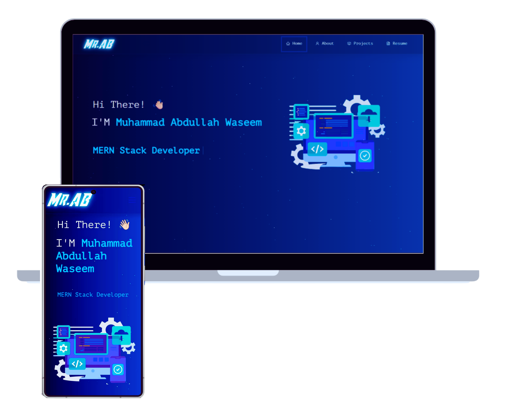

# Muhammad Abdullah Waseem — Portfolio

  

## Overview
Personal portfolio website built with React. This site highlights projects, skills, and resume.

## Credit
Original template by [Soumyajit4419](https://github.com/soumyajit4419/Portfolio) — [soumyajit.vercel.app](https://soumyajit.vercel.app/).

## Built With
- React.js
- React-Bootstrap
- CSS3

## Features
- Multi-page layout
- Fully responsive
- Easy to customize

## Getting Started
You will need `node.js` and `git` installed.

## Installation
1. Install dependencies: `npm install`
2. Start the dev server: `npm start`

## Usage
Edit your content in:
- `src/components/`
- `src/Assets/`

## Deployment Notes
Update social meta tags in `public/index.html` (title, URL, and image).
