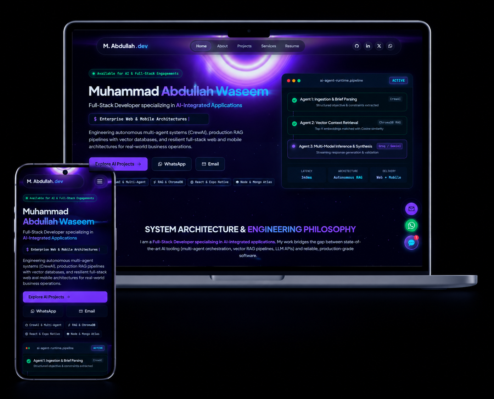

# 🚀 Muhammad Abdullah Waseem — Portfolio

### Full-Stack Developer | AI-Integrated Applications & Autonomous Systems

[](https://muhammad-abdullah-portfolio1.netlify.app)
[](https://github.com/muhammadabdullahwaseem-coder)
[](https://www.linkedin.com/in/m-abdullah-waseem)
[](https://wa.me/923270256089)
[](mailto:muhammadabdullah121254@gmail.com)

> **Engineering Autonomous Multi-Agent Systems (CrewAI), Context-Aware RAG Pipelines (ChromaDB), and Resilient Full-Stack Web & Mobile Architectures for Real-World Business Operations.**

---

## 📱 Responsive Laptop & Mobile Interface



---

## 🌟 Overview & Engineering Philosophy

This portfolio showcases my production full-stack platforms, autonomous multi-agent pipelines, and computer vision systems.

- **Edge-to-edge Cosmic Aesthetic**: Deep obsidian backdrop (`#030014`), ambient glowing black-hole canvas animation, and subtle violet-to-cyan accent gradients (`#8B5CF6` to `#38BDF8`).
- **Live Architecture Telemetry**: An interactive `ai-agent-runtime.pipeline` terminal component visualizing structured brief ingestion, ChromaDB vector matching, and Groq/Gemini inference in real-time.
- **Client AI Chat Assistant**: An integrated client onboarding bot with instant quote inquiry channels and direct WhatsApp handoff.
- **Verified On-Page Resume**: A dark-mode glassmorphic CV viewer mirroring production credentials, with 1-click verified PDF download.
- **Mobile-First Responsive Engineering**: Tailored layouts across viewports from high-res desktop monitors to 360px mobile screens.

---

## 🛠️ Technical Competencies

| Domain | Technologies & Core Tools |
| :--- | :--- |
| **🤖 AI & Autonomous Agents** | **CrewAI**, **LangChain**, **RAG**, Vector DBs (**ChromaDB**), Prompt Engineering, **Groq API**, **Gemini API** |
| **🧠 Machine Learning & Vision** | **PyTorch**, **ResNet-50**, **FastAPI**, **Streamlit** |
| **💻 Frontend Engineering** | **React.js (v18)**, **React Native (Expo)**, **Redux Toolkit**, Context API, **Tailwind CSS**, Bootstrap, **Three.js** |
| **⚙️ Backend & Distributed APIs** | **Node.js**, **Express.js**, RESTful APIs, **Socket.io (WebSockets)**, JWT & Bcrypt Authentication |
| **🗄️ Database & Embeddings** | **MongoDB**, **MongoDB Atlas**, **Mongoose**, Vector Cosine Indexing |
| **🌐 Programming Languages** | **JavaScript (ES6+)**, **Python**, **C++**, HTML5, CSS3 |
| **🛠️ Tooling & Cloud Platforms** | **Git**, **GitHub**, VS Code, Postman, **Vercel**, **Render**, **Netlify**, Streamlit Cloud |

---

## 🚀 Featured Engineering Systems

### 1. [Upwork Proposal Generator](https://upwork-proposal-writter.streamlit.app/)
> **Multi-Agent System (CrewAI) · ChromaDB (RAG) · Jinja2 · Groq/Gemini · Streamlit**  
- Multi-agent pipeline that automates tailored proposal drafting by querying past winning bids stored in a ChromaDB vector store.
- Employs Jinja2 prompt templating and multi-model LLM routing to synthesize client-specific solutions and pitch strategies.
- **Code**: [GitHub Repository](https://github.com/muhammadabdullahwaseem-coder/UpWork-proposal-writter)

### 2. [Hafiz Bags Factory Management System](https://github.com/muhammadabdullahwaseem-coder)
> **React Native (Expo) · Node.js · Express · MongoDB Atlas · Production Infrastructure**  
- Architected and built an operations and audit management mobile app covering payroll and assembly line workflows for a manufacturing business (est. 1993).
- Resolved low-level ISP DNS blocking of MongoDB SRV records and Expo runtime compatibility to ensure 99.9% uptime on physical factory floor devices.

### 3. [Vehicle Damage Detection System](https://vehicle-damage-detection-system-dl.streamlit.app/)
> **Deep Learning · Computer Vision · PyTorch · ResNet-50 · FastAPI · Streamlit**  
- End-to-end computer vision triage tool that identifies and classifies exterior automotive damage severity to expedite insurance assessment and fleet dispatch.
- **Code**: [GitHub Repository](https://github.com/muhammadabdullahwaseem-coder/Vehicle-Damage-Detection-system)

### 4. [Sharpen Prompt](https://sharpen-prompt.vercel.app/)
> **Electron · Vite / React · Node.js Proxy Server · Gemini API**  
- Cross-platform prompt engineering utility (ships as web, desktop `.exe`, and Android `.apk`).
- Features a provider-agnostic Node.js backend proxy translating and benchmark-optimizing prompts to avoid hallucinations.

### 5. [Nex-Link](https://link-shortener-by-mrab.onrender.com/)
> **Node.js · Express · MongoDB · REST APIs**  
- Scalable URL shortener service with deterministic hash generation, fast redirection, and MongoDB persistence.
- **Code**: [GitHub Repository](https://github.com/muhammadabdullahwaseem-coder/Nex-Link)

### 6. [Real-Time Chat Application](https://chat-app-socket-io-mj0n.onrender.com/)
> **React · Node.js · Socket.io · WebSockets**  
- Bi-directional messaging platform with instant packet delivery, active room states, and multi-user concurrency handling.
- **Code**: [GitHub Repository](https://github.com/muhammadabdullahwaseem-coder/Chat_App)

### 7. [3D Solar System Explorer](https://solar-system-by-abdullah.vercel.app/)
> **Three.js · WebGL · Orbital Mechanics**  
- Interactive 3D astronomical simulation rendering realistic planetary orbits, textures, lighting, and customizable camera rigs.
- **Code**: [GitHub Repository](https://github.com/muhammadabdullahwaseem-coder/solar_system)

---

## 📂 Project Architecture

```
1Portfolio/
├── Images/                         # High-res README showcases & device mockups
│   ├── readme-img1.png             # Laptop & Smartphone responsive mockup
│   └── readme-img.png              # Full desktop interface capture
├── public/
│   ├── favicon.png                 # Glowing neon </> tab icon
│   ├── favicon.ico                 # Multi-resolution favicon bundle
│   ├── index.html                  # SEO tags, fonts & metadata
│   └── manifest.json               # Web App Manifest
├── src/
│   ├── Assets/                     # Media, project banners & Resume PDF
│   │   ├── Muhammad-Abdullah-Resume.pdf
│   │   └── Projects/               # Optimized project screenshots
│   ├── components/
│   │   ├── About/                  # Engineering bio, tech stack & tools
│   │   ├── ChatAssistant/          # Interactive AI onboarding chat widget
│   │   ├── Contact/                # Direct contact channels
│   │   ├── FloatingButtons/        # Context-sensitive floating actions
│   │   ├── Home/                   # Hero section & AI architecture telemetry
│   │   ├── Navbar.js               # Responsive floating capsule nav & drawer
│   │   ├── Projects/               # 3-column project cards & case studies
│   │   ├── Resume/                 # Verified glassmorphic CV viewer
│   │   └── Services/               # Engineering services & bespoke tooling
│   ├── App.js                      # Route orchestrator
│   ├── index.js                    # React DOM entrypoint
│   └── style.css                   # Obsidian/Violet design system & media queries
└── package.json                    # Project dependencies & build scripts
```

---

## 📬 Connect & Inquiries

I am available for **AI system design, full-stack engagements, autonomous agent workflows, and production software consulting**.

- 🌐 **Live Website**: [muhammad-abdullah-portfolio1.netlify.app](https://muhammad-abdullah-portfolio1.netlify.app)
- 💬 **WhatsApp**: [+92 327 0256089](https://wa.me/923270256089)
- ✉️ **Email**: [muhammadabdullah121254@gmail.com](mailto:muhammadabdullah121254@gmail.com)
- 💼 **LinkedIn**: [linkedin.com/in/m-abdullah-waseem](https://www.linkedin.com/in/m-abdullah-waseem)
- 🐙 **GitHub**: [@muhammadabdullahwaseem-coder](https://github.com/muhammadabdullahwaseem-coder)
- 🐦 **X / Twitter**: [@MAbdullah121254](https://x.com/MAbdullah121254)

---

<div align="center">
  <sub>Designed & Developed with precision by <strong>Muhammad Abdullah Waseem</strong>. © 2026 All rights reserved.</sub>
</div>
